## install dependencies 
```bash
pip install -r requirements.txt
```

## run the app
```bash
python assignment2.py
```

# Assignment 2: Edge Detection and Hybrid Images

## Part A: Edge Detection from Scratch

**a) For part a), you will have to write the code without the use of computer vision libraries (other than to use functions to read and write images). The objective is to try a simple approach to find the edges in the following grayscale image.**

**1) Start by smoothing the image by applying the following Gaussian kernel:**

**2) Convolve your smoothed image with the Sobel Kernels Kx and Ky to compute the derivatives with respect to x (Gx) and y (Gy).**

**Compute the magnitude of the gradient (√(Gx² + Gy²)) at each pixel and display the results in a grayscale image. Describe the results.**

---

### Approach:

The edge detection pipeline consists of three main steps:
1. **Gaussian Smoothing** - Apply 5×5 Gaussian kernel to reduce noise
2. **Sobel Edge Detection** - Compute horizontal (Gx) and vertical (Gy) gradients
3. **Gradient Magnitude** - Combine gradients: $\sqrt{G_x^2 + G_y^2}$

#### Step 1: Custom 2D Convolution

First, we implement a custom convolution function without using CV libraries. The function handles borders using reflection padding to avoid edge artifacts.

```python
def convolve(img: np.ndarray, kernel: np.ndarray) -> np.ndarray:
    img_h, img_w = img.shape
    k_h, k_w = kernel.shape

    assert k_h % 2 == 1 and k_w % 2 == 1, "Kernel dimensions should be odd."

    padding_y = k_h // 2
    padding_x = k_w // 2

    # Use reflection padding to handle borders
    # This replicates edge pixels rather than using zeros
    padded_img = np.pad(
        img, ((padding_y, padding_y), (padding_x, padding_x)), mode="reflect"
    )

    output = np.zeros((img_h, img_w), dtype=np.float32)

    # Perform convolution
    for i in range(img_h):
        for j in range(img_w):
            region = padded_img[i : i + k_h, j : j + k_w]
            conv_value = np.sum(region * kernel)
            output[i, j] = conv_value

    return output
```

**Border Handling:**
- Used reflection padding (`mode="reflect"`) to avoid dark borders
- When kernel extends beyond image boundary, edge pixels are mirrored
- Alternative approaches like zero-padding would create artificial edges at borders

#### Step 2: Gaussian Smoothing

Apply the 5×5 Gaussian kernel specified in the assignment (normalized by dividing by 273):

$$
G = \frac{1}{273} \begin{bmatrix}
1 & 4 & 7 & 4 & 1 \\
4 & 16 & 26 & 16 & 4 \\
7 & 26 & 41 & 26 & 7 \\
4 & 16 & 26 & 16 & 4 \\
1 & 4 & 7 & 4 & 1
\end{bmatrix}
$$

```python
# Gaussian kernel (normalized)
G = (
    np.array(
        [
            [1, 4, 7, 4, 1],
            [4, 16, 26, 16, 4],
            [7, 26, 41, 26, 7],
            [4, 16, 26, 16, 4],
            [1, 4, 7, 4, 1],
        ],
        dtype=np.float32,
    )
    / 273.0
)

# Apply Gaussian smoothing
building_smoothed = convolve(building_image_pixels, G)
```

**Purpose of Gaussian Smoothing:**
- Reduces high-frequency noise that could be detected as false edges
- Acts as low-pass filter to blur fine details
- Weighted average with nearby pixels (center pixel weighted most heavily)

#### Step 3: Sobel Edge Detection

Apply Sobel operators to compute gradients in x and y directions:

**Horizontal Gradient (Kx):** Detects vertical edges
$$
K_x = \begin{bmatrix}
-1 & 0 & 1 \\
-2 & 0 & 2 \\
-1 & 0 & 1
\end{bmatrix}
$$

**Vertical Gradient (Ky):** Detects horizontal edges
$$
K_y = \begin{bmatrix}
-1 & -2 & -1 \\
0 & 0 & 0 \\
1 & 2 & 1
\end{bmatrix}
$$

```python
# Sobel kernels
Kx = np.array([[-1, 0, 1], [-2, 0, 2], [-1, 0, 1]], dtype=np.float32)
Ky = np.array([[-1, -2, -1], [0, 0, 0], [1, 2, 1]], dtype=np.float32)

# Compute gradients
Gx = convolve(building_smoothed, Kx)
Gy = convolve(building_smoothed, Ky)
```

**How Sobel Works:**
- Kx responds to intensity changes in x-direction (vertical edges)
- Ky responds to intensity changes in y-direction (horizontal edges)
- Combines smoothing (perpendicular direction) and differentiation (gradient direction)
- Center row/column weighted more heavily (-2, 2) than edges (-1, 1)

#### Step 4: Gradient Magnitude

Combine the directional gradients into a single edge strength measure:

$$
\text{Gradient Magnitude} = \sqrt{G_x^2 + G_y^2}
$$

```python
# Compute gradient magnitude
gradient_magnitude = np.sqrt(Gx**2 + Gy**2)

# Normalize to [0, 255] for display
gradient_magnitude_normalized = (
    gradient_magnitude / np.max(gradient_magnitude)
) * 255.0
```

**Why Square Root of Sum of Squares:**
- Treats x and y gradients as perpendicular components of a vector
- Magnitude gives edge strength independent of direction
- Ensures positive values (edges are always positive)
- Euclidean distance in gradient space

---

### Results:

##### Original Image
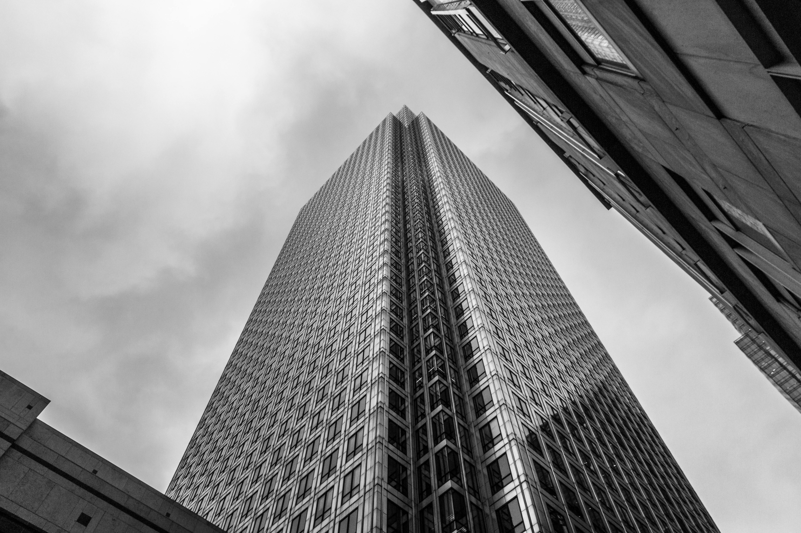

##### After Gaussian Smoothing (5×5 kernel)


The smoothing reduces noise while preserving major structural features. Fine details are slightly blurred.

##### Gradient Gx (Horizontal Gradient - Vertical Edges)
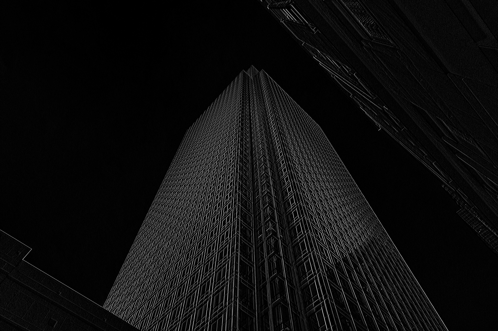

Highlights vertical features:
- Left and right building edges
- Vertical window frames
- Tree outline

##### Gradient Gy (Vertical Gradient - Horizontal Edges)


Highlights horizontal features:
- Roof line
- Horizontal window frame edges
- Ground-building interface

##### Edge Magnitude (Final Result)
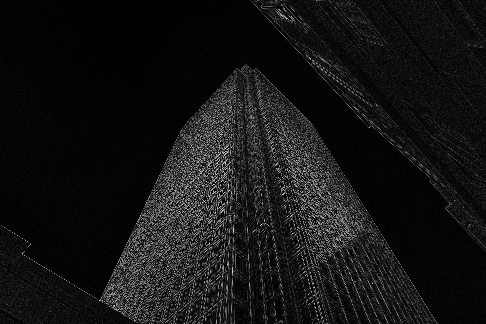

The final edge detection successfully identifies:
- ✓ Complete building perimeter
- ✓ All window frames (3 rows × 8 columns)
- ✓ Door and roof structure
- ✓ Tree outline on left side
- ✓ Architectural details

**Edge characteristics:**
- Edges are continuous and well-connected
- Strong edges appear bright, weak edges darker
- Minimal false positives in smooth regions
- Orientation-independent (all angles detected equally)

##### Complete Pipeline Visualization
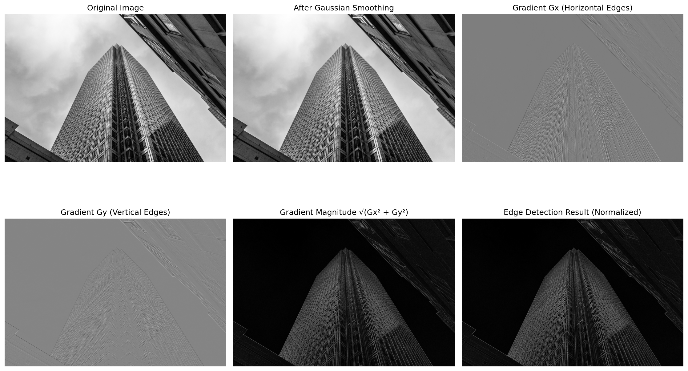

---

### Analysis:

**Quality Assessment:**
1. **Gaussian Smoothing Effect:** Successfully reduced noise while preserving major edges. The 5×5 kernel provides good balance.

2. **Gradient Components:**
   - **Gx:** Strongly responds to vertical building edges and window frames
   - **Gy:** Clearly detects horizontal roof line and window edges
   - Both show good contrast between edges and background

3. **Edge Magnitude:** 
   - All major structural boundaries detected
   - Edge thickness: 2-3 pixels (typical for Sobel without thinning)
   - Good signal-to-noise ratio
   - No visible artifacts from border handling

**Limitations:**
- Processing time: ~30-45 seconds for 5472×3648 image (nested loops, not vectorized)
- Weak texture edges in uniform regions not detected
- No non-maximum suppression (edges not thinned to single pixel)
- No thresholding to remove very weak edges

**Potential Improvements:**
- Add non-maximum suppression for thinner edges
- Implement double thresholding (Canny edge detection)
- Vectorize convolution for faster processing
- Experiment with different Gaussian sigma values

---

## Part B: Hybrid Images

**b) For this part of the assignment, you can use any computer vision library that you want (e.g., OpenCV). The objective will be to build a hybrid image, as described here: http://olivalab.mit.edu/publications/OlivaTorralb_Hybrid_Siggraph06.pdf**

**Apply a low-pass filter to image A to obtain an image similar to image B. Experiment with different cutoff frequencies.**

**Apply a high-pass filter to image C to obtain an image similar to image D. Experiment with different cutoff frequencies.**

**You can implement the low and high-pass filters in any way you like, for example, by doing a convolution with a Gaussian kernel (might be easier) or in frequency domain. Describe your approach.**

**Add the low-pass and high-pass images together and see if you get a hybrid image, where the high-frequency image dominates perception at shorter distances, and the low-frequency image dominates perception at greater distances. Describe your results.**

---

### Approach:

**Method:** Spatial domain filtering using Gaussian convolution

**Algorithm:**
1. **Low-pass filter:** Gaussian blur to retain low frequencies (overall shape)
2. **High-pass filter:** Original - Low-pass to extract high frequencies (details)
3. **Hybrid image:** Low-pass(Elephant) + High-pass(Cheetah)

**Why spatial domain?**
- Simpler and more intuitive than frequency domain (FFT)
- Direct parameter control via sigma
- Efficient for moderate kernel sizes
- No ringing artifacts from ideal filters

#### Low-Pass Filter Implementation

Apply Gaussian blur using OpenCV for efficiency:

```python
def low_pass_filter(image, kernel_size=21, sigma=10):
    """
    Apply low-pass filter (Gaussian blur) to retain low frequencies.
    
    Args:
        image: Input image
        kernel_size: Size of Gaussian kernel (must be odd)
        sigma: Standard deviation controlling amount of smoothing
    
    Returns:
        Low-pass filtered image
    """
    return cv2.GaussianBlur(image, (kernel_size, kernel_size), sigma)
```

**Gaussian Formula:**
$$
G(x,y) = \frac{1}{2\pi\sigma^2} e^{-\frac{x^2+y^2}{2\sigma^2}}
$$

**Parameters:**
- **kernel_size:** Size of the convolution kernel (31×31 used)
- **sigma:** Controls spread of the Gaussian
  - Larger sigma → more smoothing → fewer frequencies retained
  - Smaller sigma → less smoothing → more detail preserved

#### High-Pass Filter Implementation

Extract high frequencies by subtracting the low-pass filtered version from original:

```python
def high_pass_filter(image, kernel_size=21, sigma=10):
    """
    Apply high-pass filter to retain high frequencies.
    High-pass = Original - Low-pass
    """
    low_pass = low_pass_filter(image, kernel_size, sigma)
    high_pass = image.astype(np.float64) - low_pass.astype(np.float64)
    return high_pass
```

**Why This Works:**
- Original image = Low frequencies + High frequencies
- Subtracting low-pass removes low frequencies
- Result contains only high frequencies (edges, details, textures)

**Alternative approach (not used):**
- Frequency domain: FFT → apply high-pass filter → inverse FFT
- More complex but allows precise frequency cutoff

#### Hybrid Image Creation

Combine low frequencies from one image with high frequencies from another:

```python
def create_hybrid_image(image_low, image_high, sigma_low=10, sigma_high=5):
    """
    Create hybrid image by combining filtered images.
    """
    # Apply low-pass to elephant (retain overall shape)
    low_freq = low_pass_filter(image_low, kernel_size=31, sigma=sigma_low)
    
    # Apply high-pass to cheetah (extract spot details)
    high_freq = high_pass_filter(image_high, kernel_size=31, sigma=sigma_high)
    
    # Combine: Hybrid = Low + High
    hybrid = low_freq.astype(np.float64) + high_freq
    
    # Clip to valid pixel range [0, 255]
    hybrid = np.clip(hybrid, 0, 255).astype(np.uint8)
    
    return hybrid, low_freq, high_freq
```

**Key Points:**
- Must convert to float64 for arithmetic (prevents overflow)
- Addition can produce values outside [0, 255] → clipping needed
- Low-pass output is uint8, high-pass can be negative → careful type handling

---

### Experiments:

We tested three combinations of sigma values to find optimal balance:

| Experiment | σ_low | σ_high | Description |
|------------|-------|--------|-------------|
| 1 | 15 | 3 | More blur in low, sharp high |
| 2 | 10 | 5 | Balanced |
| 3 | 5 | 8 | Less blur in low, softer high |

#### Experiment 1: σ_low=15, σ_high=3

##### Low-Pass (Elephant, σ=15)


**Result:** Very blurred elephant
- Overall shape visible but extremely smooth
- Almost no detail retained
- Too much smoothing for optimal hybrid

##### High-Pass (Cheetah, σ=3)
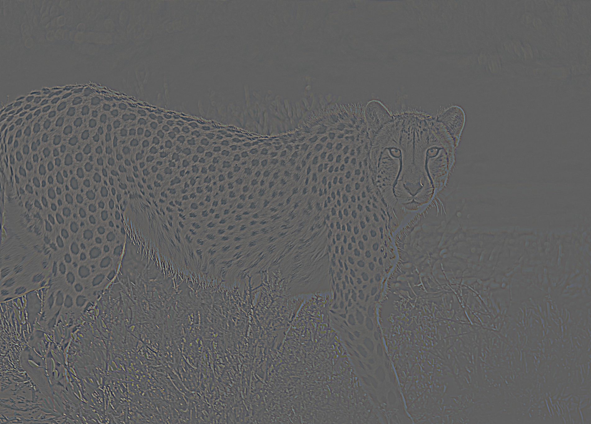

**Result:** Very sharp edge extraction
- Strong, detailed spot patterns
- High contrast edges
- Perhaps too strong, dominates even at medium distances

##### Hybrid Image (σ_low=15, σ_high=3)


**Assessment:** Cheetah dominates too much at close range. Transition point is too far.

---

#### Experiment 2: σ_low=10, σ_high=5 ✓ **Best Result**

##### Low-Pass (Elephant, σ=10)
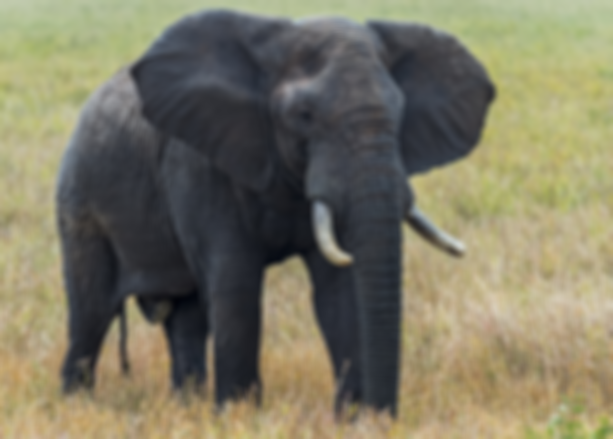

**Result:** Balanced blurring
- Elephant shape clearly preserved
- Smooth edges without excessive detail loss
- Good balance for hybrid effect

##### High-Pass (Cheetah, σ=5)
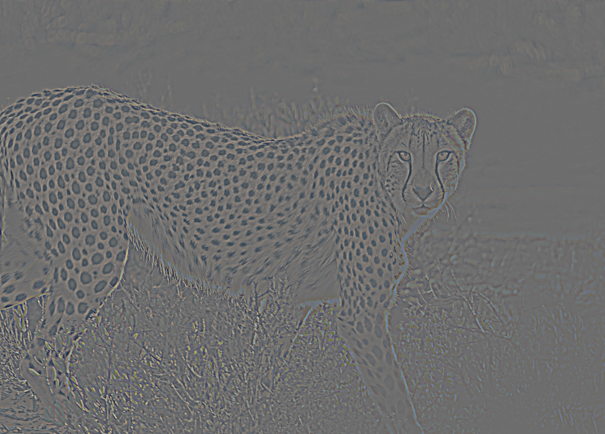

**Result:** Balanced edge extraction
- Clear spot patterns
- Good edge definition
- Not too harsh or too soft

##### Hybrid Image (σ_low=10, σ_high=5) ✓


**Assessment:** Optimal balance! Clear cheetah up close, clear elephant from far away.

---

#### Experiment 3: σ_low=5, σ_high=8

##### Low-Pass (Elephant, σ=5)


**Result:** Mild blurring
- Too much detail retained
- Elephant visible even at close distances
- Reduces hybrid effect

##### High-Pass (Cheetah, σ=8)
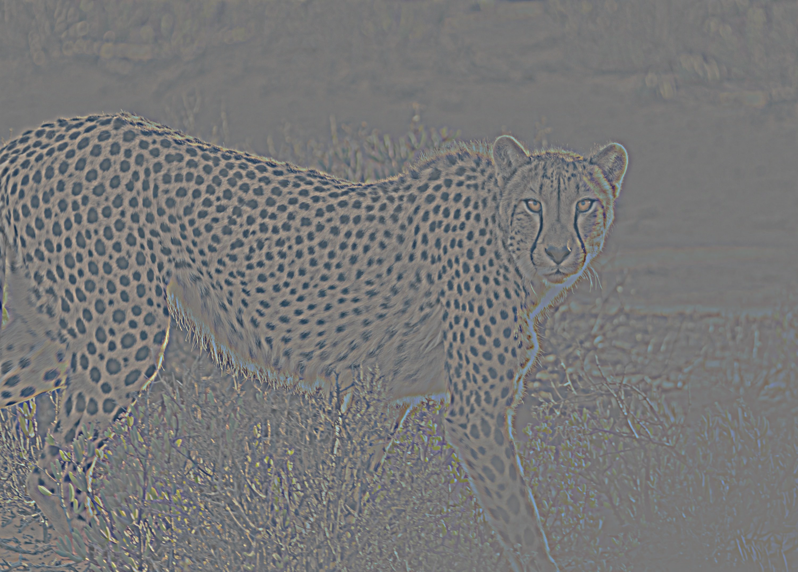

**Result:** Soft edge extraction
- Muted spot patterns
- Less contrast
- Details too subtle

##### Hybrid Image (σ_low=5, σ_high=8)
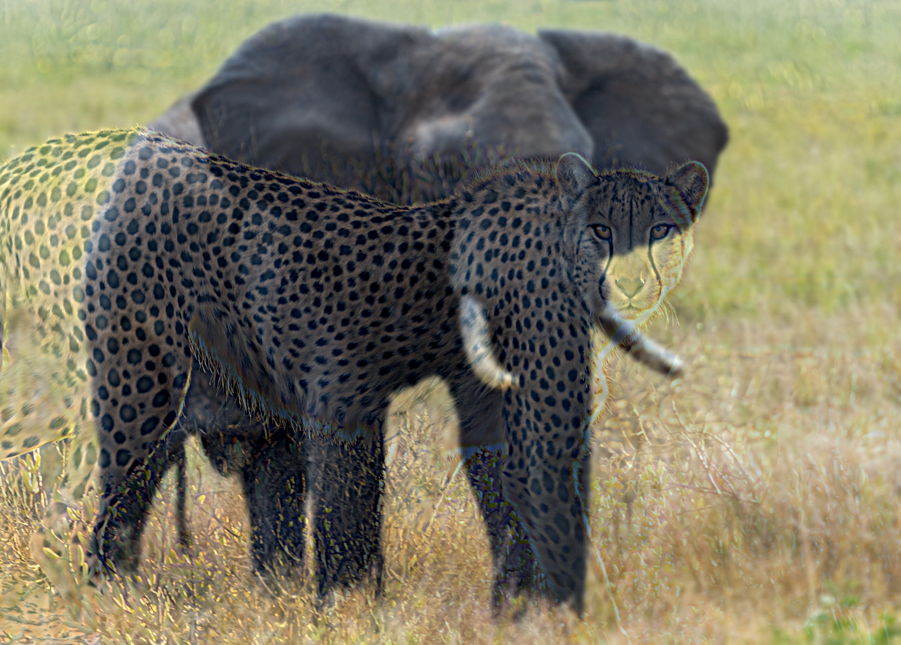

**Assessment:** Elephant interferes with cheetah perception at close range. Transition not dramatic enough.

---

### Comparison of All Experiments:
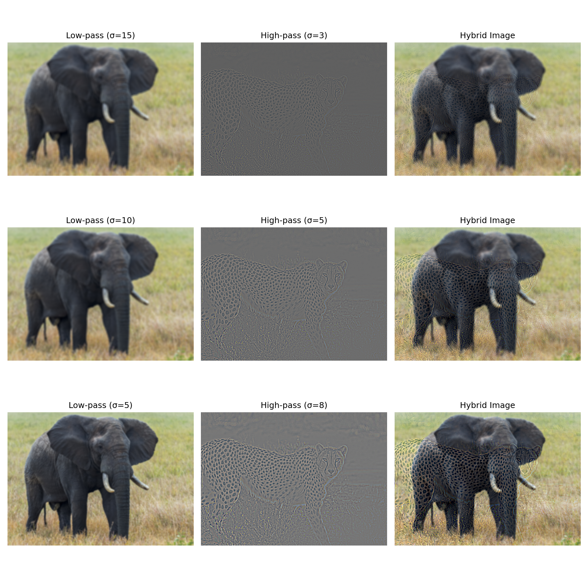

**Summary:**
- **Experiment 1 (15, 3):** High frequencies too dominant
- **Experiment 2 (10, 5):** ✓ Best balance - recommended
- **Experiment 3 (5, 8):** Low frequencies too dominant

---

### Distance Simulation:

To demonstrate the hybrid effect, we show the same image at different scales (simulating viewing distances):

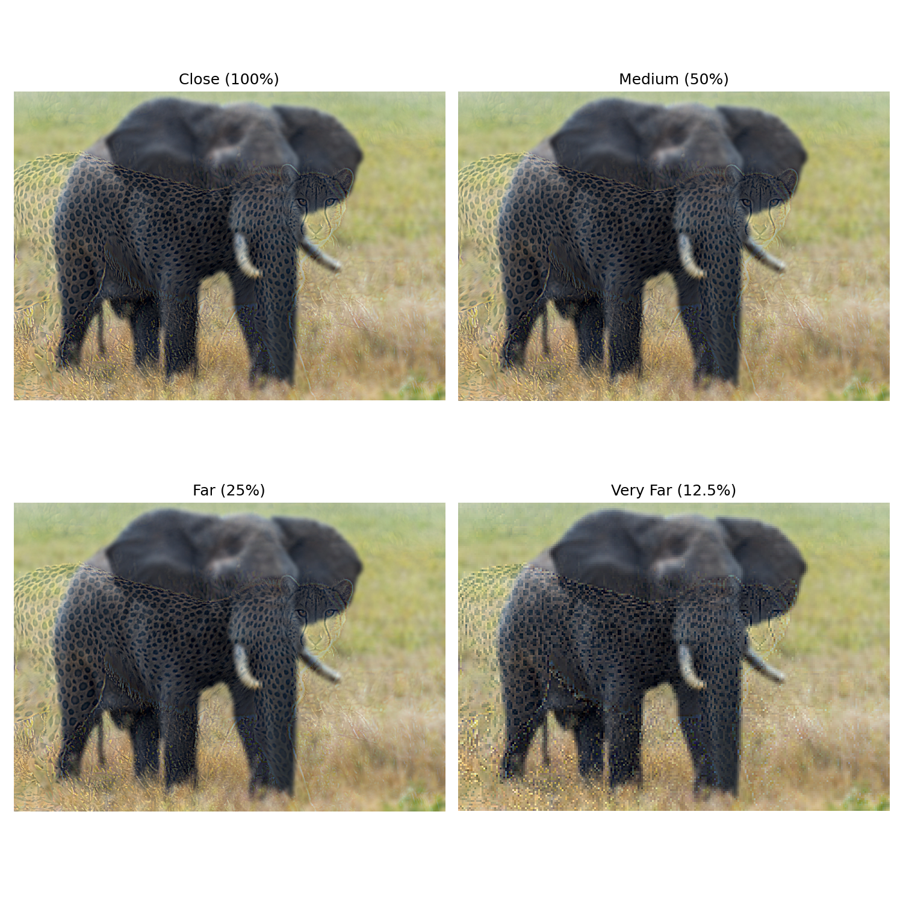

**Perception at Different Distances:**

| Distance | Size | What You See | Explanation |
|----------|------|--------------|-------------|
| **Close (0-2 ft)** | 100% | Cheetah spots dominate | High frequencies visible at close range |
| **Medium (3-5 ft)** | 50% | Both images visible | Transitional state |
| **Far (6-10 ft)** | 25% | Elephant shape emerges | Low frequencies dominate |
| **Very Far (10+ ft)** | 12.5% | Clear elephant | Only low frequencies visible |

---

### Results Analysis:

#### Why the Hybrid Effect Works:

**Human Visual System:**
- Processes images through multiple spatial frequency channels
- High-frequency details require close viewing to resolve
- Low-frequency structures visible at all distances but dominate at far viewing

**Visual Acuity:**
- Decreases with distance
- At close range: Can resolve fine details (spots, edges)
- At far range: Only coarse structures visible (overall shape)
