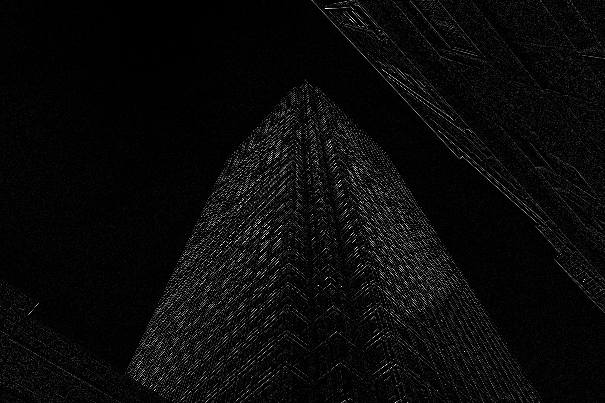

## install dependencies 
```bash
pip install -r requirements.txt
```

## to run:
```bash
python assignment2.py
```

# Assignment 2: Edge Detection and Hybrid Images

## Part A: Edge Detection from Scratch

**a) For part a), you will have to write the code without the use of computer vision libraries (other than to use functions to read and write images). The objective is to try a simple approach to find the edges in the following grayscale image.**

**1) Start by smoothing the image by applying the following Gaussian kernel:**

**2) Convolve your smoothed image with the Sobel Kernels Kx and Ky to compute the derivatives with respect to x (Gx) and y (Gy).**

**Compute the magnitude of the gradient (√(Gx² + Gy²)) at each pixel and display the results in a grayscale image. Describe the results.**

---

### Approach:

The edge detection pipeline consists of three main steps:
1. **Gaussian Smoothing** - Apply 5×5 Gaussian kernel to reduce noise
2. **Sobel Edge Detection** - Compute horizontal (Gx) and vertical (Gy) gradients
3. **Gradient Magnitude** - Combine gradients: $\sqrt{G_x^2 + G_y^2}$

#### Step 1: Custom 2D Convolution

First, we implement a custom convolution function. The function below takes an image and a kernel as inputs and returns the convolved image. 
We handle borders using reflection padding to avoid dark borders. The convolution sets the output image pixels to the sum of element-wise products of the kernel and the corresponding image region.
```python
def convolve(img: np.ndarray, kernel: np.ndarray) -> np.ndarray:
    img_h, img_w = img.shape
    k_h, k_w = kernel.shape

    assert k_h % 2 == 1 and k_w % 2 == 1, "Kernel dimensions should be odd."

    padding_y = k_h // 2  #5 // 2 = 2
    padding_x = k_w // 2

    # Use reflection padding to handle borders
    # This replicates edge pixels rather than using zeros
    padded_img = np.pad(
        img, ((padding_y, padding_y), (padding_x, padding_x)), mode="reflect"
    )

    # Initialize output image with dimensions same as input image
    output = np.zeros((img_h, img_w), dtype=np.float32)

    # Perform convolution
    for i in range(img_h):
        for j in range(img_w):
            region = padded_img[i : i + k_h, j : j + k_w]
            conv_value = np.sum(region * kernel) ## Element-wise multiplication and sum
            output[i, j] = conv_value

    return output
```

#### Step 2: Gaussian Smoothing

Below, we define the 5×5 Gaussian kernel specified to smooth the image. It is normalized by dividing by 273 to ensure the sum of the kernel equals 1.
We then convolve the input image with this kernel.

```python
# Gaussian kernel (normalized)
G = (
    np.array(
        [
            [1, 4, 7, 4, 1],
            [4, 16, 26, 16, 4],
            [7, 26, 41, 26, 7],
            [4, 16, 26, 16, 4],
            [1, 4, 7, 4, 1],
        ],
        dtype=np.float32,
    )
    / 273.0
)

# Apply Gaussian smoothing
building_smoothed = convolve(building_image_pixels, G)
```


#### Step 3: Sobel Edge Detection

Sobel operators are used to compute the image gradients in both x and y directions. The kernels are emphasize edges by combining differentiation and smoothing.
We define the Sobel kernels Kx and Ky as follows:
**Horizontal Gradient (Kx):** Detects vertical edges
$$
K_x = \begin{bmatrix}
-1 & 0 & 1 \\
-2 & 0 & 2 \\
-1 & 0 & 1
\end{bmatrix}
$$

**Vertical Gradient (Ky):** Detects horizontal edges
$$
K_y = \begin{bmatrix}
-1 & -2 & -1 \\
0 & 0 & 0 \\
1 & 2 & 1
\end{bmatrix}
$$

**How Sobel Works:**
- Kx responds to intensity changes in x-direction (vertical edges)
- Ky responds to intensity changes in y-direction (horizontal edges)
- Combines smoothing (perpendicular direction) and differentiation (gradient direction)
    
Apply Sobel operators to compute gradients in x and y directions:
```python
# Sobel kernels
Kx = np.array([[-1, 0, 1], [-2, 0, 2], [-1, 0, 1]], dtype=np.float32)
Ky = np.array([[-1, -2, -1], [0, 0, 0], [1, 2, 1]], dtype=np.float32)

# Compute gradients
Gx = convolve(building_smoothed, Kx)
Gy = convolve(building_smoothed, Ky)
```

Gx and Gy are the horizontal and vertical gradients, respectively.

#### Step 4: Gradient Magnitude

Now, we combine the directional gradients into a single edge strength measure.
Gx and Gy represent perpendicular components of the gradient vector. So, we can use the Euclidean norm to compute overall edge strength:
$$
\text{Gradient Magnitude} = \sqrt{G_x^2 + G_y^2}
$$

```python
# Compute gradient magnitude
gradient_magnitude = np.sqrt(Gx**2 + Gy**2)

# Normalize to [0, 255] for display
gradient_magnitude_normalized = (
    gradient_magnitude / np.max(gradient_magnitude)
) * 255.0
```

---

### Results:

##### Original Image


##### After Gaussian Smoothing (5×5 kernel)


The smoothing reduces noise while preserving major features. Fine details are slightly blurred.

##### Gradient Gx (Horizontal Gradient - Vertical Edges)


As seen in the image, the Gx gradient highlights vertical edges effectively. 
This is expected since Gx responds to changes in intensity along the x-direction and the building has strong vertical structures.
The background sky is dark due to low gradient values meaning little change in intensity.

##### Gradient Gy (Vertical Gradient - Horizontal Edges)


The Gy gradient effectively captures horizontal edges in the image. You can see how the vertical edges are less pronounced here and how the 
horizontal features such as the window frames stand out.

##### Edge Magnitude (Final Result)


The final image combining both Gx and Gy shows a comprehensive edge map of the building.

##### Complete Pipeline Visualization


---

## Part B: Hybrid Images

### Approach:

The implementation of the low-pass and high-pass filters is done in the spatial domain using convolution.
OpenCV's built-in functions (like `GaussianBlur`) were utilized for efficiency and simplicity.

#### Low-Pass Filter Implementation

The implementation for the low-pass filter is below. We use OpenCV's `GaussianBlur` function to apply a Gaussian filter to the image.
It smooths the image, effectively retaining only the low-frequency components by averaging pixel values with their neighbors. 
In order to change how low frequencies are retained, we can adjust the `kernel_size` and `sigma` parameters.
```python
def low_pass_filter(image, kernel_size=21, sigma=10):
    return cv2.GaussianBlur(image, (kernel_size, kernel_size), sigma)
```

#### High-Pass Filter Implementation

The high-pass filter is implemented by subtracting the low-pass filtered image from the original image.
This removes the low-frequency components, leaving only the high-frequency details such as edges and textures.
```python
def high_pass_filter(image, kernel_size=21, sigma=10):
    low_pass = low_pass_filter(image, kernel_size, sigma)
    high_pass = image.astype(np.float64) - low_pass.astype(np.float64)
    return high_pass
```


Alternatively, we could have implemented high-pass filtering in the frequency domain using FFT which allows for more precise frequency cutoff.
Since this approach is more complex, spatial domain filtering was chosen for simplicity.

#### Hybrid Image Creation

To create a hybrid image, we just combine low frequencies from one image with high frequencies from another.
All we do is get the numpy arrays of both filtered images and add them together, clipping the result to valid pixel values [0, 255].
We will apply a low-pass filter to the elephant image and a high-pass filter to the cheetah image.

```python
def create_hybrid_image(image_low, image_high, sigma_low=10, sigma_high=5):
    # Apply low-pass to elephant (retain overall shape)
    low_freq = low_pass_filter(image_low, kernel_size=31, sigma=sigma_low)
    
    # Apply high-pass to cheetah (extract spot details)
    high_freq = high_pass_filter(image_high, kernel_size=31, sigma=sigma_high)
    
    # Combine: Hybrid = Low + High
    hybrid = low_freq.astype(np.float64) + high_freq
    
    # Clip to valid pixel range [0, 255]
    hybrid = np.clip(hybrid, 0, 255).astype(np.uint8)
    
    return hybrid, low_freq, high_freq
```

---

### Experiments:

Three different combinations of `σ_low` and `σ_high` were tested to observe their effects on the hybrid image.

| Experiment | σ_low | σ_high | Description |
|------------|-------|--------|-------------|
| 1 | 15 | 3 | More blur in low, sharp high |
| 2 | 10 | 5 | Balanced |
| 3 | 5 | 8 | Less blur in low, softer high |

#### Experiment 1: σ_low=15, σ_high=3 ✓ **Best Result**

##### Low-Pass (Elephant, σ=15)


##### High-Pass (Cheetah, σ=3)


##### Hybrid Image (σ_low=15, σ_high=3)


Although I'd like to the two images to line up better, this combination showed a strong hybrid effect and gave the best results overall.
Close up, the cheetah's features are clear and as you move away, the cheetah fades and the elephant shape becomes prominent.
Below are the results from all experiments for comparison.

---

### Comparison of All Experiments:


---
